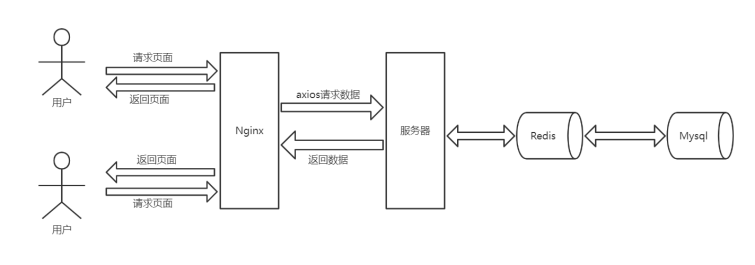
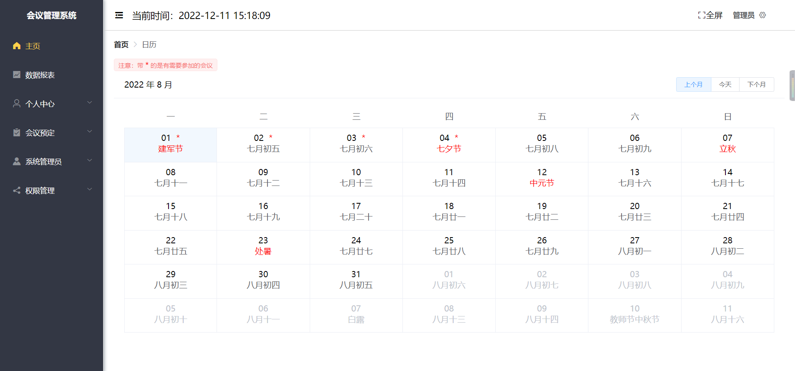
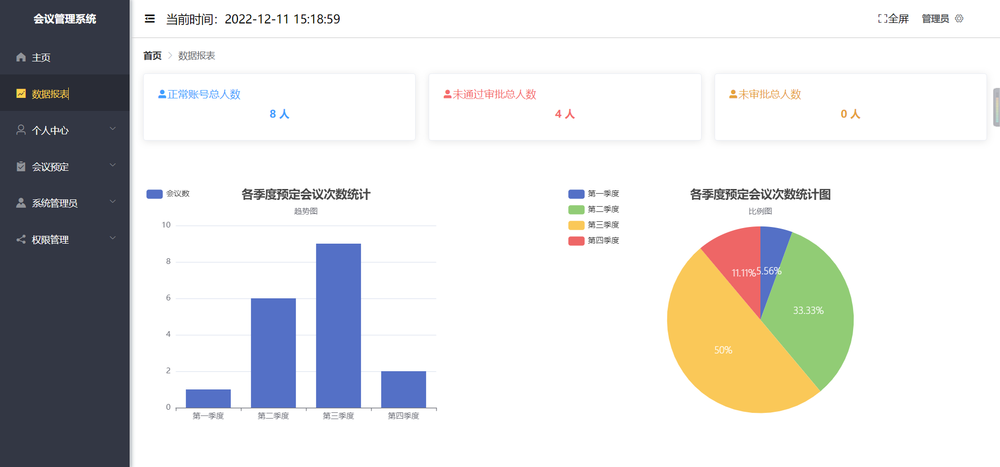
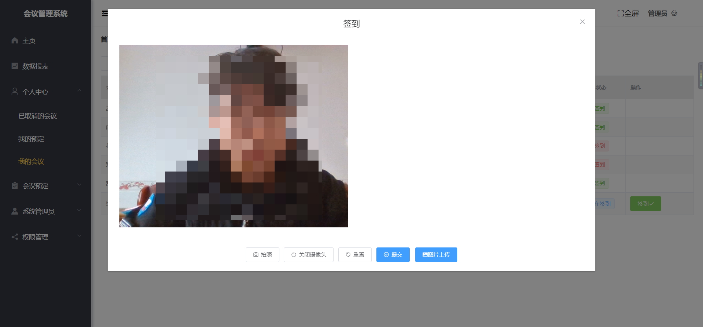
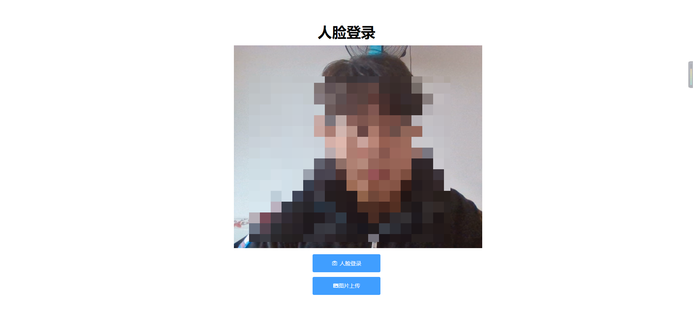

<h3 align="center">基于springboot + vue + 百度SDK 开发的前后端分离人脸识别会议签到系统</h3>

	</a>
        
	</a>
        
	
	
	
	
	
	
	
	

____

#### 介绍

基于springboot + vue + 百度SDK 开发的前后端分离人脸识别会议签到系统，支持会议的基本功能，人脸签到，照片签到，人脸登录，地图坐标签到，后台管理功能等。第十一届中国软件杯B4赛题三等奖。

在线网址：http://121.40.41.122/Meeting

#### 软件架构

B/S架构，架构图如下

#### 目录结构

SQL文件位于sql文件夹下的rookismeeting.sql，需要MySQL8以上版本。

可直接导入该项目的本地编辑器中，修改后端配置文件中的数据库等连接信息，项目中使用到的百度地图SDK和百度人脸识别SDK等需要自行开通。

#### 技术介绍

前端技术:Vue2 + Vuex + Vue - Router + Axios + Element - ui + Bootstrap + Echarts + JavaScript

后端技术:SpringBoot + Jwt + MyBatisPlus + MySQL+ Redis + Swagger + Druid + 百度SDK

#### 开发环境

| 开发工具  |说明   |
|---|---|
|  IDEA |  Java开发工具 |
|VSCode | Vue开发工具IDE|

| 开发环境  |版本   |
|---|---|
|JDK   |1.8   |
|MYSQL   | 8.0.12  |
|Redis   | 5.0.14  |
|Node |14.19.0

#### 项目效果
* 首页

* 会议统计可视化

* 会议签到

* 人脸识别登录

#### 部署项目

1、后端项目使用IDEA打开，一键启动

2、前端下载依赖，npm install

3、前端启动，npm run serve

4、如需要部署上线，可参考系统部署说明书

#### 注意事项

若部署失败或不成功可加作者QQ：2740860037来咨询
